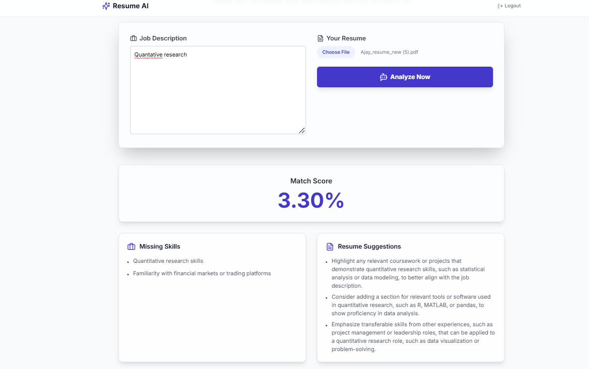
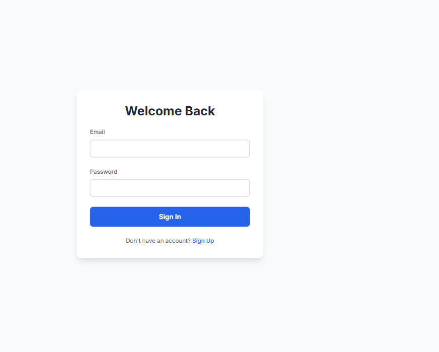
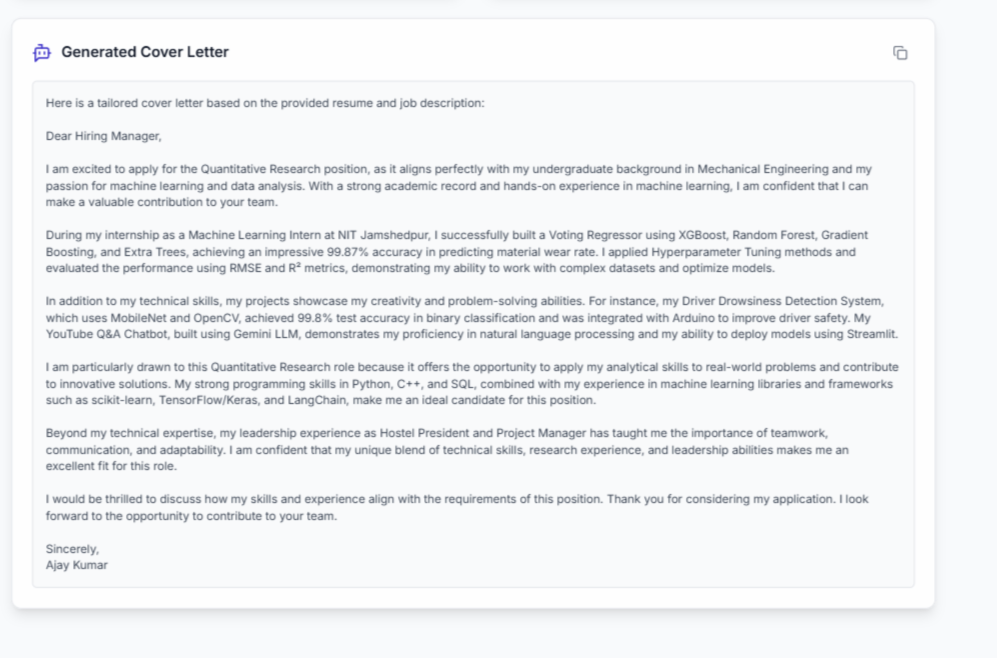

AI Resume Analyzer & Job Match Assistant\
An intelligent, full-stack application that leverages AI to score resumes against job descriptions, provide actionable feedback, and generate tailored cover letters.

Table of Contents
✨ Core Features

📸 Screenshots

🛠️ Tech Stack

🚀 Local Development Setup

🚢 Deployment

💡 Future Improvements

👤 Contact

✨ Core Features
Semantic Match Score: Calculates a precise percentage score by analyzing the semantic similarity between a resume and a job description using vector embeddings.

AI-Powered Gap Analysis: Identifies critical skills and keywords present in the job description but missing from the resume, providing a clear path for improvement.

Actionable Feedback: Delivers specific, AI-generated suggestions to enhance the resume's content, structure, and alignment with the target role.

Automated Cover Letter Generation: Instantly creates a professional, tailored cover letter that highlights relevant experience from the resume.

Secure User Authentication: Implements JWT-based authentication to ensure user data and analysis history remain private and secure.

Modern, Responsive Interface: A clean and intuitive UI built with React and Tailwind CSS for a seamless experience on all devices.

📸 Screenshots
Login Page

Dashboard & Analysis Results

🛠️ Tech Stack
This project is a modern monorepo with a decoupled frontend and backend.

Backend (FastAPI)
Framework: FastAPI for high-performance, asynchronous APIs.

Database: MongoDB with pymongo for flexible data storage.

Authentication: JWT (python-jose) & Password Hashing (passlib[bcrypt]).

AI & ML:

LLM Provider: Groq for fast, real-time text generation.

Vector Embeddings: sentence-transformers for semantic analysis.

Production Server: Gunicorn & Uvicorn workers.

File Handling: PyMuPDF & python-docx for text extraction.

Frontend (React)
Framework: React (with Vite + TypeScript) for a fast, type-safe UI.

Styling: Tailwind CSS for rapid, utility-first design.

API Communication: Axios & TanStack Query for efficient data fetching.

Routing & Forms: React Router & React Hook Form.

UI Components: Lucide React (icons) & React Hot Toast (notifications).

🚀 Local Development Setup
Follow these instructions to set up and run the project locally.

Prerequisites
Python 3.10+

Node.js 18+ and npm

A MongoDB Atlas connection URI

A Groq API Key

Installation & Setup
Clone the repository:

git clone https://github.com/rahulkasmar/resume-match-ai.git
cd resume-match-ai

Configure Environment Variables:
Create a .env file in the project root. Copy the contents of .env.example (you should create this file) and fill in your secret keys.

# .env.example
MONGO_URI="your_mongodb_connection_string"
JWT_SECRET="a_very_strong_random_secret_key"
JWT_ALGORITHM="HS26"
JWT_EXPIRATION_MINUTES=30
GROQ_API_KEY="gsk_your_groq_api_key"

Backend Setup:

# Create and activate a Python virtual environment
python -m venv venv
source venv/bin/activate  # On Windows: .\venv\Scripts\activate

# Install Python dependencies
pip install -r requirements.txt

Frontend Setup:

# Navigate to the frontend directory
cd frontend

# Install Node.js dependencies
npm install

Running the Application
You will need to run two separate terminal processes.

Start the Backend Server (from the project root):

uvicorn main:app --reload

Backend running at http://127.0.0.1:8000

Start the Frontend Server (from the /frontend directory):

npm run dev

Frontend running at http://localhost:5173

🚢 Deployment
This application is configured for easy deployment on modern cloud platforms:

Backend (FastAPI): Deployed as a Web Service on Render.

Frontend (React): Deployed as a static site on Vercel.

Environment variables for deployment are managed directly through the cloud provider's dashboard.

💡 Future Improvements\
[ ] Analysis History: Implement a dedicated page for users to view and manage their past analysis results.

[ ] Document Export: Add the ability to edit and download the generated cover letter as a .txt or .docx file.

[ ] Advanced Skill Extraction: Integrate a more advanced NLP model (e.g., using spaCy) for more granular skill identification.

[ ] Testing: Add a comprehensive suite of unit and integration tests for the backend API.

👤 Contact
Rahul Kumar

Email: [prajapatirahul202122@gmail.com]

Project Repository: https://github.com/rahulkasmar/resume-match-ai
